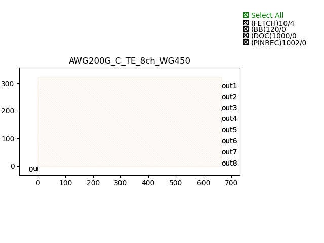
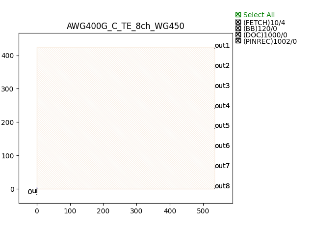

Arrayed Waveguide Gratings (AWG)
######################################

AWG200G_C_TE_8ch_WG450
***************************

+-------+------------------------+-------------+
| ports |     waveguide type     | orientation |
+=======+========================+=============+
|  in0  | TECH.WG.Channel.C.WIRE |     180     |
+-------+------------------------+-------------+
|  out1 | TECH.WG.Channel.C.WIRE |      0      |
+-------+------------------------+-------------+
|  out2 | TECH.WG.Channel.C.WIRE |      0      |
+-------+------------------------+-------------+
|  out3 | TECH.WG.Channel.C.WIRE |      0      |
+-------+------------------------+-------------+
|  out4 | TECH.WG.Channel.C.WIRE |      0      |
+-------+------------------------+-------------+
|  out5 | TECH.WG.Channel.C.WIRE |      0      |
+-------+------------------------+-------------+
|  out6 | TECH.WG.Channel.C.WIRE |      0      |
+-------+------------------------+-------------+
|  out7 | TECH.WG.Channel.C.WIRE |      0      |
+-------+------------------------+-------------+
|  out8 | TECH.WG.Channel.C.WIRE |      0      |
+-------+------------------------+-------------+

AWG400G_C_TE_8ch_WG450
***********************************

+-------+------------------------+-------------+
| ports |     waveguide type     | orientation |
+=======+========================+=============+
|  in0  | TECH.WG.Channel.C.WIRE |     180     |
+-------+------------------------+-------------+
|  out1 | TECH.WG.Channel.C.WIRE |      0      |
+-------+------------------------+-------------+
|  out2 | TECH.WG.Channel.C.WIRE |      0      |
+-------+------------------------+-------------+
|  out3 | TECH.WG.Channel.C.WIRE |      0      |
+-------+------------------------+-------------+
|  out4 | TECH.WG.Channel.C.WIRE |      0      |
+-------+------------------------+-------------+
|  out5 | TECH.WG.Channel.C.WIRE |      0      |
+-------+------------------------+-------------+
|  out6 | TECH.WG.Channel.C.WIRE |      0      |
+-------+------------------------+-------------+
|  out7 | TECH.WG.Channel.C.WIRE |      0      |
+-------+------------------------+-------------+
|  out8 | TECH.WG.Channel.C.WIRE |      0      |
+-------+------------------------+-------------+

