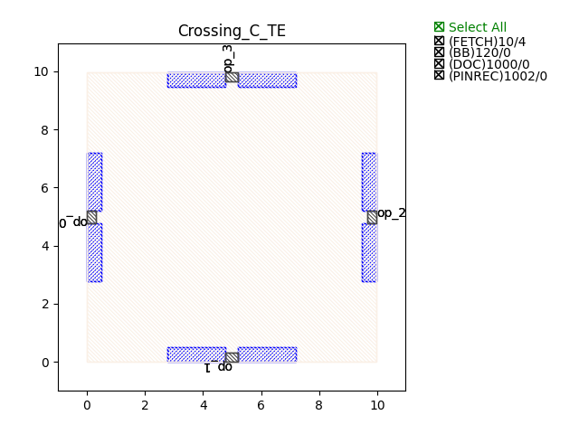
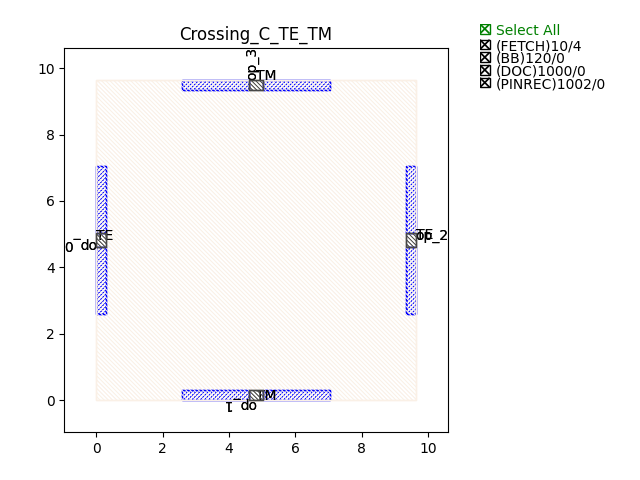
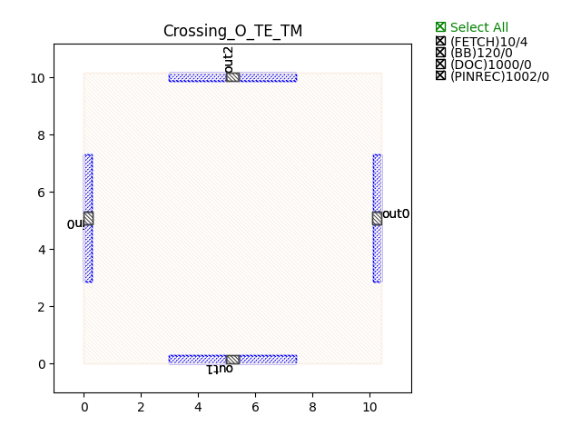
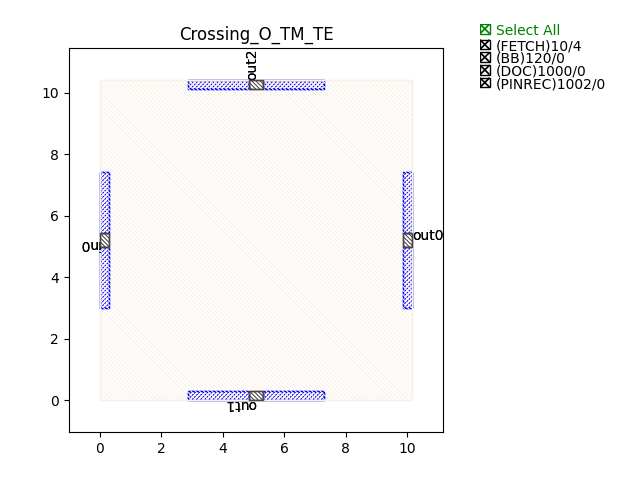

Crossings
###########

Crossing_C_TE
******************

+-------+------------------------+-------------+
| ports |     waveguide type     | orientation |
+=======+========================+=============+
|  op_0 | TECH.WG.Channel.C.WIRE |     180     |
+-------+------------------------+-------------+
|  op_1 | TECH.WG.Channel.C.WIRE |      -90    |
+-------+------------------------+-------------+
|  op_2 | TECH.WG.Channel.C.WIRE |     0       |
+-------+------------------------+-------------+
|  op_3 | TECH.WG.Channel.C.WIRE |      90     |
+-------+------------------------+-------------+

Crossing_C_TE_TM
******************

+-------+-----------------------------+-------------+
| ports |     waveguide type          | orientation |
+=======+=============================+=============+
|  op_0 | TECH.WG.Channel.C.WIRE      |     180     |
+-------+-----------------------------+-------------+
|  op_1 | TECH.WG.Channel.C.WIRE_TETM |      -90    |
+-------+-----------------------------+-------------+
|  op_2 | TECH.WG.Channel.C.WIRE      |     0       |
+-------+-----------------------------+-------------+
|  op_3 | TECH.WG.Channel.C.WIRE_TETM |      90     |
+-------+-----------------------------+-------------+

Crossing_C_TM_TE
******************

+-------+-----------------------------+-------------+
| ports |     waveguide type          | orientation |
+=======+=============================+=============+
|  in0  | TECH.WG.Channel.C.WIRE_TETM |     180     |
+-------+-----------------------------+-------------+
|  out1 | TECH.WG.Channel.C.WIRE      |      -90    |
+-------+-----------------------------+-------------+
|  out0 | TECH.WG.Channel.C.WIRE_TETM |     0       |
+-------+-----------------------------+-------------+
|  out2 | TECH.WG.Channel.C.WIRE      |      90     |
+-------+-----------------------------+-------------+

Crossing_O_TE
******************

+-------+-----------------------------+-------------+
| ports |     waveguide type          | orientation |
+=======+=============================+=============+
|  op_0 | TECH.WG.Channel.O.WIRE      |     180     |
+-------+-----------------------------+-------------+
|  op_1 | TECH.WG.Channel.O.WIRE      |      -90    |
+-------+-----------------------------+-------------+
|  op_2 | TECH.WG.Channel.O.WIRE      |     0       |
+-------+-----------------------------+-------------+
|  op_3 | TECH.WG.Channel.O.WIRE      |      90     |
+-------+-----------------------------+-------------+

Crossing_O_TE_TM
******************

+-------+-----------------------------+-------------+
| ports |     waveguide type          | orientation |
+=======+=============================+=============+
|  in0  | TECH.WG.Channel.O.WIRE      |     180     |
+-------+-----------------------------+-------------+
|  out1 | TECH.WG.Channel.O.WIRE_TETM |      -90    |
+-------+-----------------------------+-------------+
|  out0 | TECH.WG.Channel.O.WIRE      |     0       |
+-------+-----------------------------+-------------+
|  out2 | TECH.WG.Channel.O.WIRE_TETM |      90     |
+-------+-----------------------------+-------------+

Crossing_O_TM_TE
******************

+-------+-----------------------------+-------------+
| ports |     waveguide type          | orientation |
+=======+=============================+=============+
|  in0  | TECH.WG.Channel.O.WIRE_TETM |     180     |
+-------+-----------------------------+-------------+
|  out1 | TECH.WG.Channel.O.WIRE      |      -90    |
+-------+-----------------------------+-------------+
|  out0 | TECH.WG.Channel.O.WIRE_TETM |     0       |
+-------+-----------------------------+-------------+
|  out2 | TECH.WG.Channel.O.WIRE      |      90     |
+-------+-----------------------------+-------------+

