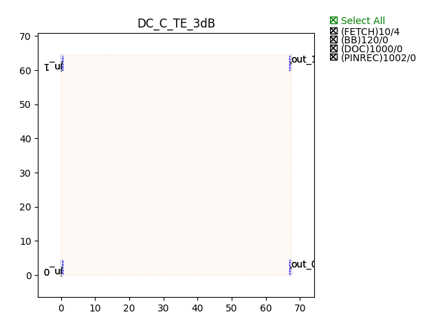
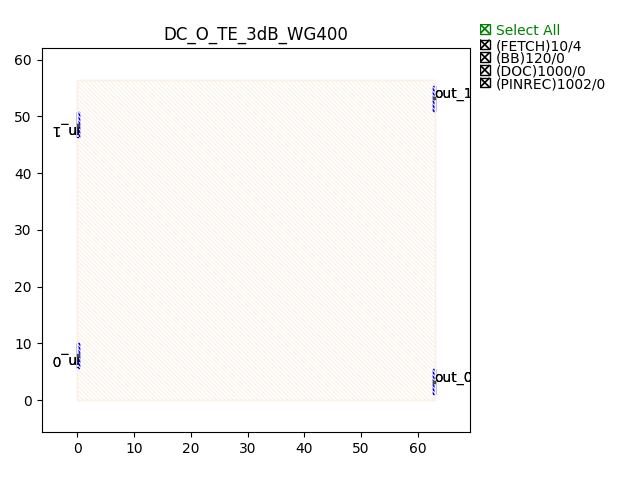

Directional Couplers (DC)
################################

DC_C_TE_3dB
***************

+-------+-----------------------------+-------------+
| ports |     waveguide type          | orientation |
+=======+=============================+=============+
|  in_0 | TECH.WG.Channel.C.WIRE      |     180     |
+-------+-----------------------------+-------------+
|  in_1 | TECH.WG.Channel.C.WIRE      |      180    |
+-------+-----------------------------+-------------+
| out_0 | TECH.WG.Channel.C.WIRE      |     0       |
+-------+-----------------------------+-------------+
| out_1 | TECH.WG.Channel.C.WIRE      |      0      |
+-------+-----------------------------+-------------+

DC_O_TE_3dB_WG400
******************

+-------+-----------------------------+-------------+
| ports |     waveguide type          | orientation |
+=======+=============================+=============+
|  in_0 | TECH.WG.Channel.C.WIRE      |     180     |
+-------+-----------------------------+-------------+
|  in_1 | TECH.WG.Channel.C.WIRE      |      180    |
+-------+-----------------------------+-------------+
| out_0 | TECH.WG.Channel.C.WIRE      |     0       |
+-------+-----------------------------+-------------+
| out_1 | TECH.WG.Channel.C.WIRE      |      0      |
+-------+-----------------------------+-------------+

