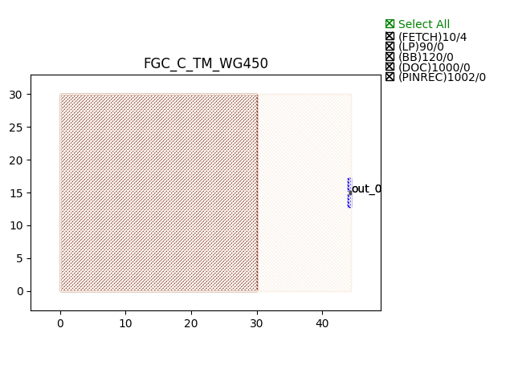
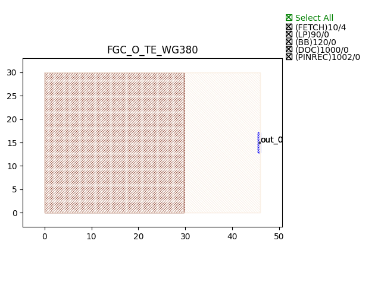
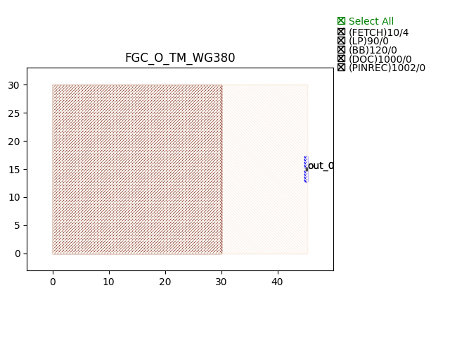

Grating Couplers (GC)
#############################

FGC_C_TE_WG450
*****************

+-------+-----------------------------+-------------+
| ports |     waveguide type          | orientation |
+=======+=============================+=============+
| out_0 | TECH.WG.Channel.C.WIRE      |       0     |
+-------+-----------------------------+-------------+

FGC_C_TM_WG450
*****************

+-------+-----------------------------+-------------+
| ports |     waveguide type          | orientation |
+=======+=============================+=============+
| out_0 | TECH.WG.Channel.C.WIRE_TETM |       0     |
+-------+-----------------------------+-------------+

FGC_O_TE_WG380
*****************

+-------+-----------------------------+-------------+
| ports |     waveguide type          | orientation |
+=======+=============================+=============+
| out_0 | TECH.WG.Channel.O.WIRE      |       0     |
+-------+-----------------------------+-------------+

FGC_O_TM_WG380
*****************

+-------+-----------------------------+-------------+
| ports |     waveguide type          | orientation |
+=======+=============================+=============+
| out_0 | TECH.WG.Channel.O.WIRE_TETM |       0     |
+-------+-----------------------------+-------------+

