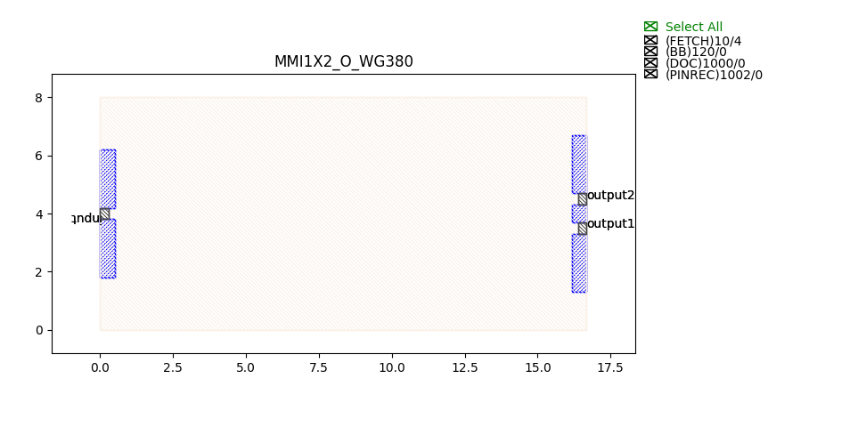

MultiMode Interferometers (MMI)
####################################

MMI1X2_C_WG450
******************
.. image:: ../images/MMI1X2_C_WG450.png

+--------+-----------------------------+-------------+
| ports  |     waveguide type          | orientation |
+========+=============================+=============+
|input   | TECH.WG.Channel.C.WIRE      |     180     |
+--------+-----------------------------+-------------+
| output0| TECH.WG.Channel.C.WIRE      |        0    |
+--------+-----------------------------+-------------+
| output1| TECH.WG.Channel.C.WIRE      |     0       |
+--------+-----------------------------+-------------+

MMI1X2_O_WG380
******************

+--------+-----------------------------+-------------+
| ports  |     waveguide type          | orientation |
+========+=============================+=============+
|input   | TECH.WG.Channel.O.WIRE      |     180     |
+--------+-----------------------------+-------------+
| output0| TECH.WG.Channel.O.WIRE      |        0    |
+--------+-----------------------------+-------------+
| output1| TECH.WG.Channel.O.WIRE      |     0       |
+--------+-----------------------------+-------------+

MMI2X2_C_SE_WG450
******************
+--------+-----------------------------+-------------+
| ports  |     waveguide type          | orientation |
+========+=============================+=============+
| in_0   | TECH.WG.Channel.C.WIRE      |     180     |
+--------+-----------------------------+-------------+
| in_1   | TECH.WG.Channel.C.WIRE      |     180     |
+--------+-----------------------------+-------------+
| out_0  | TECH.WG.Channel.C.WIRE      |        0    |
+--------+-----------------------------+-------------+
| out_1  | TECH.WG.Channel.C.WIRE      |     0       |
+--------+-----------------------------+-------------+

MMI2X2_O_WG380
******************

+--------+-----------------------------+-------------+
| ports  |     waveguide type          | orientation |
+========+=============================+=============+
| input0 | TECH.WG.Channel.O.WIRE      |     180     |
+--------+-----------------------------+-------------+
| input1 | TECH.WG.Channel.O.WIRE      |     180     |
+--------+-----------------------------+-------------+
| output0| TECH.WG.Channel.O.WIRE      |        0    |
+--------+-----------------------------+-------------+
| output1| TECH.WG.Channel.O.WIRE      |     0       |
+--------+-----------------------------+-------------+

