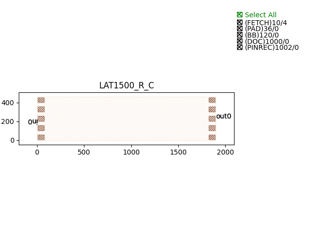

Mach-Zehnder Modulators (MZM)
#####################################

LAT1500_R_C
********************

+--------+-----------------------------+-------------+
| ports  |     waveguide type          | orientation |
+========+=============================+=============+
|in0     | TECH.WG.Channel.C.WIRE      |     180     |
+--------+-----------------------------+-------------+
| out0   | TECH.WG.Channel.C.WIRE      |        0    |
+--------+-----------------------------+-------------+
