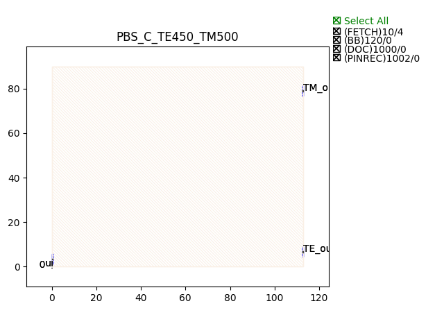

Polarizing Beam Splitters (PBS)
###################################

PBS_C_TE450_TM500
*********************

+-------+-----------------------------+-------------+
| ports |     waveguide type          | orientation |
+=======+=============================+=============+
|  in0  | TECH.WG.Channel.C.WIRE      |     180     |
+-------+-----------------------------+-------------+
| TE_out| TECH.WG.Channel.C.WIRE      |        0    |
+-------+-----------------------------+-------------+
| TM_out| TECH.WG.Channel.C.WIRE_TETM |     0       |
+-------+-----------------------------+-------------+

