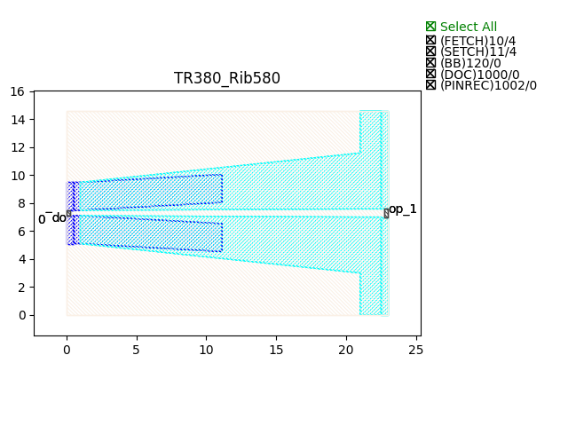
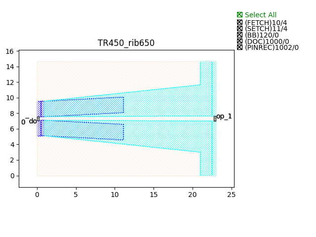

Transitions
#################

TR380_Rib580
****************

+-------+-----------------------------+-------------+
| ports |     waveguide type          | orientation |
+=======+=============================+=============+
| op_0  | TECH.WG.Channel.O.WIRE      |     180     |
+-------+-----------------------------+-------------+
| op_1  | TECH.WG.Rib.O.WIRE          |     0       |
+-------+-----------------------------+-------------+

TR450_rib650
****************

+-------+-----------------------------+-------------+
| ports |     waveguide type          | orientation |
+=======+=============================+=============+
| op_0  | TECH.WG.Channel.C.WIRE      |     180     |
+-------+-----------------------------+-------------+
| op_1  | TECH.WG.Rib.C.WIRE          |     0       |
+-------+-----------------------------+-------------+

