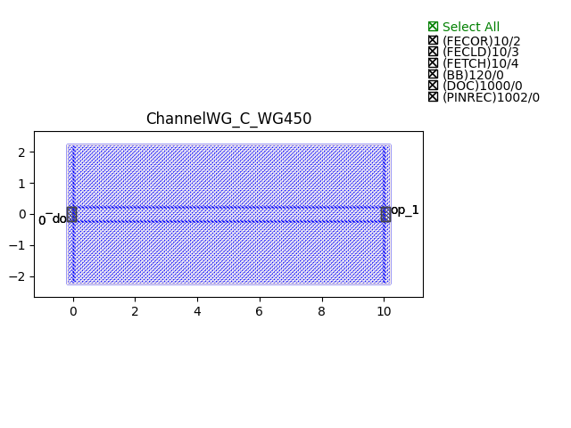
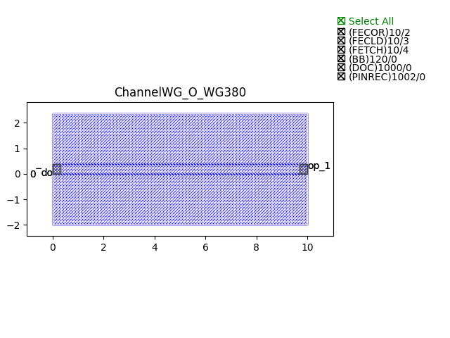
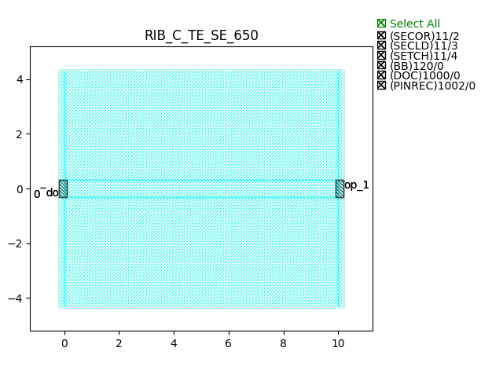
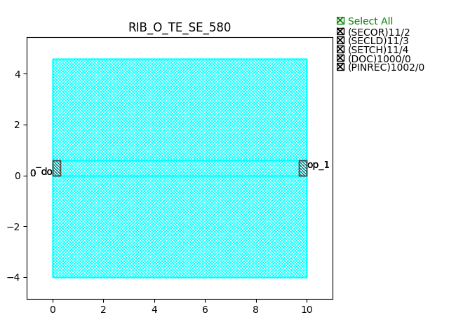

Waveguides
#######################

ChannelWG_C_WG450
**********************

+-------+-----------------------------+-------------+
| ports |     waveguide type          | orientation |
+=======+=============================+=============+
|  op_0 | TECH.WG.Channel.C.WIRE      |     180     |
+-------+-----------------------------+-------------+
|  op_1 | TECH.WG.Channel.C.WIRE      |        0    |
+-------+-----------------------------+-------------+

ChannelWG_O_WG380
**********************

+-------+-----------------------------+-------------+
| ports |     waveguide type          | orientation |
+=======+=============================+=============+
|  op_0 | TECH.WG.Channel.O.WIRE      |     180     |
+-------+-----------------------------+-------------+
|  op_1 | TECH.WG.Channel.O.WIRE      |        0    |
+-------+-----------------------------+-------------+

RIB_C_TE_SE_650
**********************

+-------+-----------------------------+-------------+
| ports |     waveguide type          | orientation |
+=======+=============================+=============+
|  op_0 | TECH.WG.Rib.O.WIRE          |     180     |
+-------+-----------------------------+-------------+
|  op_1 | TECH.WG.Rib.O.WIRE          |        0    |
+-------+-----------------------------+-------------+

RIB_C_TE_SEFE_450_1000
***********************
.. image:: ../images/RIB_C_TE_SEFE_450_1000.png

+-------+-----------------------------+-------------+
| ports |     waveguide type          | orientation |
+=======+=============================+=============+
|  op_0 | TECH.WG.Rib.C_SEFE.WIRE     |     180     |
+-------+-----------------------------+-------------+
|  op_1 | TECH.WG.Rib.C_SEFE.WIRE     |        0    |
+-------+-----------------------------+-------------+

RIB_O_TE_SE_580
**********************

+-------+-----------------------------+-------------+
| ports |     waveguide type          | orientation |
+=======+=============================+=============+
|  op_0 | TECH.WG.Rib.O.WIRE          |     180     |
+-------+-----------------------------+-------------+
|  op_1 | TECH.WG.Rib.O.WIRE          |        0    |
+-------+-----------------------------+-------------+